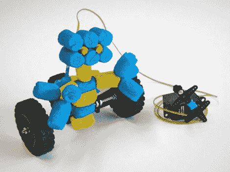

# 手摇电动玩具没有电池或电源

> 原文：<https://hackaday.com/2012/09/28/hand-cranked-electric-toy-has-no-batteries-or-power-supply/>

我们认为[这个手摇机器人设计](http://www.instructables.com/id/Dynamo-Rover)是绝对的辉煌。这个玩具是通过一小段电线遥控的。它可以前进和转弯，但不能同时前进和转弯。考虑到它不使用电池或电源，并且在两个伺服电机中，只有一个实际上在机器人本身中，这仍然令人印象深刻。

右侧可见的第二个伺服系统充当发电机。当你转动曲柄时，电就产生了。那个伺服系统的输入连接到机器人的输入来驱动它。如果你朝一个方向转动曲柄，彩色玩具就会向前移动。但是在其中一个侧轮上有一个单向捕捉器，所以当伺服机构向后转动时，这个小家伙实际上执行了反向转动。构建这样一个项目的魔力非常适合周末和孩子们一起活动。不要错过跳转后嵌入的演示。

[https://www.youtube.com/embed/3q6Okaq6ChE?version=3&rel=1&showsearch=0&showinfo=1&iv_load_policy=1&fs=1&hl=en-US&autohide=2&wmode=transparent](https://www.youtube.com/embed/3q6Okaq6ChE?version=3&rel=1&showsearch=0&showinfo=1&iv_load_policy=1&fs=1&hl=en-US&autohide=2&wmode=transparent)

[via [被黑的小工具](http://hackedgadgets.com/2012/07/02/dynamo-robot-made-from-a-hacked-servo-motor-doesnt-need-any-batteries/)