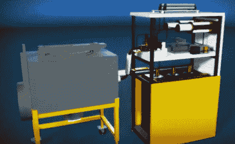

# 四分之一收缩器的工作原理

> 原文：<https://hackaday.com/2012/09/28/how-a-quarter-shrinker-works/>

这台机器能够缩小硬币。你现在看到的实际上是一个极客团体脉冲发生器的 3D 模型，它被称为踏脚计划。这个模型被用来解释[感应如何将 25 美分缩小到 10 美分硬币的大小](http://www.youtube.com/watch?v=C_5myKEarfg)。

左边的灰色小室是一个加固的密封装置。这是一个安全功能，可以让人们和跺脚器呆在同一个房间里，免受可能由这东西产生的力量造成的飞行粒子的伤害。你看，它利用巨大的磁能将硬币的边缘压入自身。

正如休息后的视频所示，右边机器的主要部分通过使用微波炉变压器提升电源电压启动。这使交流电达到 2000 伏，然后整流并进一步升压到 6000 伏 DC。这为三个巨大的并联电容器充电，然后这些电容器能够以 6 kV 的电压提供 100，000A 的电流。到了开火的时候，电荷被注入一个线圈，线圈的中心是硬币。结果就是我们之前提到的粉碎磁场。

这并不是一个新概念，在 Hackaday 存在的早期，我们就推出了[一个不同的硬币破碎机版本](http://hackaday.com/2007/10/17/quarter-shrinker-can-crusher-follow-up/)。

[https://www.youtube.com/embed/C_5myKEarfg?version=3&rel=1&showsearch=0&showinfo=1&iv_load_policy=1&fs=1&hl=en-US&autohide=2&wmode=transparent](https://www.youtube.com/embed/C_5myKEarfg?version=3&rel=1&showsearch=0&showinfo=1&iv_load_policy=1&fs=1&hl=en-US&autohide=2&wmode=transparent)