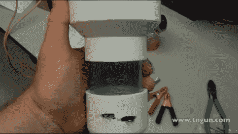

# 水净化使用自制的电解装置

> 原文：<https://hackaday.com/2012/09/28/water-purification-uses-home-built-electrolysis-rig/>

如果你提前一点计划，你可以有自己的净水系统在紧急情况下使用。每个人都需要干净的饮用水，这个小工具可以让你很容易地生产自己的净化液。

这种溶液含有氯，是通过电解产生的。靠近图像底部的 PVC 盖有两个伸出的电极。这些是由橡胶圈隔开的镀钛网板。盖子上有一个小孔，以保持低流速，顶部的配件充当漏斗。当你倒入盐水混合物时，它会通过通电的金属板，发生化学反应将钠从氯中分离出来。

这需要一个 12 伏的电源。但是由于电解过程只需要一两分钟，你可以很容易地从太阳能电池充电的电池中获得能量。休息之后，请观看完整的构建演练和演示视频。

[https://www.youtube.com/embed/uZ_MhPVYotg?version=3&rel=1&showsearch=0&showinfo=1&iv_load_policy=1&fs=1&hl=en-US&autohide=2&wmode=transparent](https://www.youtube.com/embed/uZ_MhPVYotg?version=3&rel=1&showsearch=0&showinfo=1&iv_load_policy=1&fs=1&hl=en-US&autohide=2&wmode=transparent)

[谢谢大卫]