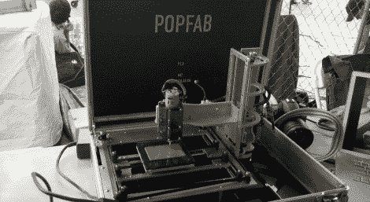
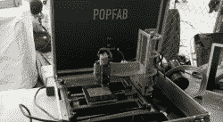
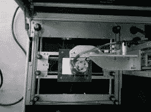
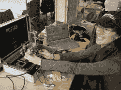

# 将数控机床、3D 打印机和乙烯基切割机装进行李箱

> 原文：<https://hackaday.com/2012/09/29/fitting-a-cnc-machine-3d-printer-and-vinyl-cutter-in-a-suitcase/>

纽约 Maker Faire 充斥着新的有趣的计算机控制工具，但迄今为止最不寻常的似乎是 Popfab，这是一种组合路由器、3D 打印机和乙烯基切割机的工具，可以折叠成一个手提箱。

Popfab 是麻省理工学院 CADLAB 的[Nadya Peek]和[Ilan Moyer]的发明。带有可互换的印刷电路板布线头、3D 打印头和乙烯基切割头。这种功能的传统机器将到处都有电机，但[Ilan]使用了一个 [CoreXY 系统](http://corexy.com/index.html)来使步进电机相对于机器的框架静止不动。

电子设备是标准的印刷电路板和 Pronterface fare，但它仍然是一个非凡的构造，也适合放入手提箱。

机器、XY 系统(祝你好运，但我可以告诉你，它依赖于两个电机的差动运动)和可爱的[Nadya]举起塑料挤出头的照片。我们明天会上传一段视频。休息过后

[https://www.youtube.com/embed/zAlJBhFkqp8?version=3&rel=1&showsearch=0&showinfo=1&iv_load_policy=1&fs=1&hl=en-US&autohide=2&wmode=transparent](https://www.youtube.com/embed/zAlJBhFkqp8?version=3&rel=1&showsearch=0&showinfo=1&iv_load_policy=1&fs=1&hl=en-US&autohide=2&wmode=transparent)