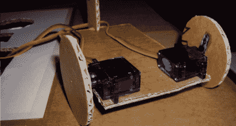

# 十美元左右的机器人。

> 原文：<https://hackaday.com/2012/10/01/l-i-o-s-the-ten-ish-dollar-robot/>

我们这里喜欢便宜的东西。谁没有呢？奥斯卡·罗德里格斯·帕拉也是，他写信给我们展示了他的超级廉价机器人。这个建筑是为了 AFRON 设计挑战，包括建造一个 10 美元的机器人来教学生机器人技术。挑战的[获胜者](http://www.robotics-africa.org/design_challenge.html)都很整洁，但是他们看起来都太花哨了，炫耀他们的模制塑料和电子线路板。

[Oscar 的]设计非常简单，LDRs 作为眼睛，PIC12F683 作为大脑，led 作为指示器，几个经过改造的伺服系统驱动车轮。一个非常复杂的纸板翻板滚轮有助于推车转弯，但除了光滑的地板，可能不会看到太多。使用我们最喜欢的技术之一安装电子元件，纸穿孔板(非常类似于[无基板技术](http://hackaday.com/2011/03/31/pcbs-without-any-substrate/))。

跳伞后，请观看视频，了解 LIOS 的行动。对于任何教室来说，这都是一个极好的机器人介绍。谢谢[奥斯卡]！

[https://www.youtube.com/embed/jwrVHF3-TMw?version=3&rel=1&showsearch=0&showinfo=1&iv_load_policy=1&fs=1&hl=en-US&autohide=2&wmode=transparent](https://www.youtube.com/embed/jwrVHF3-TMw?version=3&rel=1&showsearch=0&showinfo=1&iv_load_policy=1&fs=1&hl=en-US&autohide=2&wmode=transparent)