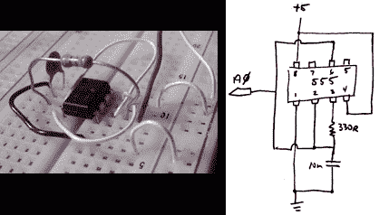

# 使用 555 定时器和 ADC 作为随机种子

> 原文：<https://hackaday.com/2012/10/01/using-a-555-timer-and-adc-as-a-random-seed/>

大多数嵌入式系统的工具链都支持随机数生成。但是如果你读过手册，你就会知道这实际上只是伪随机数生成(PRNG)。当调用这个函数时，相同的数字将总是以相同的顺序返回，除非预先提供了不同的随机数种子。[Gardner]提出了一个简单而廉价的解决方案来获得更好的随机数种子。他[使用微控制器上的 ADC](http://1474orchard.ca/projects/?x=entry:entry120926-185104) 从 555 定时器读取电压。乍一看，这似乎不是一个很大的随机性来源，但他进行了一些测试，结果看起来很有希望。

该项目针对基于 Arduino 的电路，但任何带 ADC 的芯片都可以。555 定时器用作自由运行振荡器。我们知道，即使与最差的晶体振荡器相比，这也不是很稳定，但这正是它作为随机种子源如此出色的原因。此外，额外电路的元件数量少、尺寸小，这是一个成功的组合。所以，当你需要一个随机数，但不一定需要岩石固体熵时，请记住这一点。

[通过 [Reddit](http://www.reddit.com/r/arduino/comments/10qon5/experiments_with_hardwarebased_random_number/) 和 [Freetronics](http://www.freetronics.com/blogs/news/6654822-hardware-based-random-number-generator-seed-for-arduino)