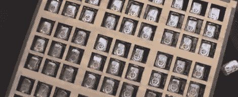

# 谢妮 Suduku 和芯片上发光二极管

> 原文：<https://hackaday.com/2012/10/02/nixie-suduku-and-on-die-leds/>

Maker Faire 上最好的展位会用难以置信的酷或荒谬的东西吸引你，并在你对主要功能的好奇心开始减弱时展示出最先进的技术。[John Sarik]在哥伦比亚大学教授的一门课的展位是这些展位中的一个。

展台的主要特色是一个装满 81 支谢妮管的数独板。如下图所示，你用一对锅来控制光标(数制小数点)。将光标移动到所需位置后，有一个小键盘可以改变 suduku 拼图上 81 个位置中的任何一个位置的数字。

[约翰]的介绍接着继续他在哥伦比亚大学的工作:他正在进行一个项目，将发光二极管阵列放在硅上，就像任何其他集成电路一样。他演示了一个内置在 DIP-40 封装中的小型 LED 显示屏，带有玻璃(或者石英)窗口。是的，这是一个非常小的 LED 矩阵显示器，像素间距可能比传统的 LCD 显示器小得多。

休息后的 suduku 机器视频，以及芯片上的 LED 矩阵图库。黑客帝国很难拍照，所以如果[约翰]能发几张照片进来，我们会很乐意贴上来。在[约翰]的 YouTube 上也有一段视频展示了谢妮·苏杜库难题用递归算法自行解决。

[https://www.youtube.com/embed/_J-uy_F3wn4?version=3&rel=1&showsearch=0&showinfo=1&iv_load_policy=1&fs=1&hl=en-US&autohide=2&wmode=transparent](https://www.youtube.com/embed/_J-uy_F3wn4?version=3&rel=1&showsearch=0&showinfo=1&iv_load_policy=1&fs=1&hl=en-US&autohide=2&wmode=transparent) [https://www.youtube.com/embed/xdmOi67PPvs?version=3&rel=1&showsearch=0&showinfo=1&iv_load_policy=1&fs=1&hl=en-US&autohide=2&wmode=transparent](https://www.youtube.com/embed/xdmOi67PPvs?version=3&rel=1&showsearch=0&showinfo=1&iv_load_policy=1&fs=1&hl=en-US&autohide=2&wmode=transparent)

此幻灯片需要 JavaScript。