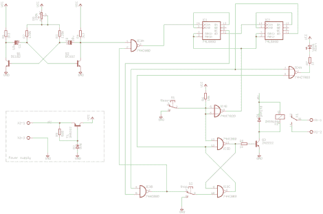

# 得益于 7400 系列芯片，几十年的老电视获得了睡眠功能

> 原文：<https://hackaday.com/2012/10/02/decades-old-tv-gets-sleep-function-thanks-to-7400-family-of-chips/>

[维克多]翻出一个他几年前做的黑客。他的爷爷喜欢在电视机前结束一天的工作，但他坐下后很快就睡着了。维克多没有让电表整夜滴答作响，而是设计了一个自动关闭功能，类似于现代电视的睡眠功能。

那时微控制器不像现在这样容易获得。所以[维克多]使用了基于 7400 系列逻辑芯片的电路。它用一个多谐振荡器给一些二进制计数器芯片供电。这些用来划分振荡以建立期望的定时。他将系统调到大约 15 分钟，但是可以使用内置在多谐振荡器中的电位计进行调整。当时间快用完时，电视旁边的 LED 就会亮起。这样，如果(维克多的)祖父还醒着，他就可以按下椅子旁边的按钮来重置计数器。但是如果他已经在打瞌睡，计数器最终会关掉电视。