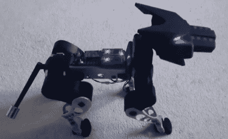

# 看起来很专业的狗机器人实际上是马丁的硕士论文

> 原文：<https://hackaday.com/2012/10/02/professional-looking-dog-robot-was-actually-martins-masters-thesis/>

如果你认为这个东西看起来不错，你应该看到它移动。【马丁·史密斯】[在项目](http://mbed.org/forum/news-announcements/topic/3963/)上打了一个本垒打，那是他的硕士论文。十五个伺服电机为机器人提供了一种四处移动的方式。模仿小型犬的步态非常逼真。尾巴甚至是功能性的，在移动腿的时候起到平衡的作用。

在进行任何物理组装之前，该项目在 3D 环境中精心构建。机械部件都是由铝铣削而成或 3D 打印而成。安装在它背部的两块 mBed 板允许它与其环境进行交互。其中一个处理图像处理，另一个驱动电机阵列。当然，他安装了一些拉森扫描仪作为眼睛也没什么坏处。

不要错过休息后的视频，它展示了从规划到演示的整个项目。我们不禁想起了 *[雪灾](http://en.wikipedia.org/wiki/Snow_Crash#Rat_Things)中的[。](http://en.wikipedia.org/wiki/Snow_Crash#Rat_Things)*

[https://www.youtube.com/embed/XiR61Ecs5JU?version=3&rel=1&showsearch=0&showinfo=1&iv_load_policy=1&fs=1&hl=en-US&autohide=2&wmode=transparent](https://www.youtube.com/embed/XiR61Ecs5JU?version=3&rel=1&showsearch=0&showinfo=1&iv_load_policy=1&fs=1&hl=en-US&autohide=2&wmode=transparent)