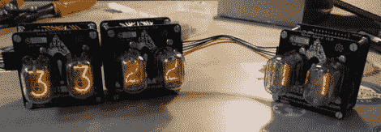

# 向危险原型的[Ian]报到

> 原文：<https://hackaday.com/2012/10/03/checking-in-with-ian-from-dangerous-prototypes/>

《危险原型》的前黑客作家和电子巫师伊恩(Ian)上周末参加了创客大会。他有一大堆很酷的东西可以炫耀，幸运的是，我们能够抓取一些视频。

首先是一个可链接的谢妮模块。像他这种水平的所有大师一样，伊恩有一个装满谢妮管的盒子，等待在一个项目中使用。这些管子从未真正进入他们的计划项目，主要是因为很难让这些旧的 Nixies 工作。为了解决这个问题，[Ian]创造了一个可链接的数码管模块-只需将高压电源连接到电路板，将其连接到您选择的微控制器，您就可以为您的项目获得 2 个谢妮管。

[伊恩]还展示了一个巧妙的解决每个制造商的问题的方案。在设计了一些很酷的电路板之后，比如巴士海盗、闪速毁灭者和逻辑嗅探器，他意识到他从来没有制作过两个同样大小的电路板。这意味着他(和其他制造商)的项目几乎不可能有一套标准化的案例。结果就是电子项目中米色标准的厌恶。

该标准提供正方形和黄金矩形 PCB 布局，包括安装孔、圆角、禁止区域以及 USB 端口和 SD 卡的建议放置位置。米色背后的想法是让制造商和制造商使用相同的纸板尺寸，这样就可以构建一套标准化的案例。这是一个很棒的想法，我们强烈推荐你的下一个项目。

休息后的视频。 [https://www.youtube.com/embed/l4FRkeeopv0?version=3&rel=1&showsearch=0&showinfo=1&iv_load_policy=1&fs=1&hl=en-US&autohide=2&wmode=transparent](https://www.youtube.com/embed/l4FRkeeopv0?version=3&rel=1&showsearch=0&showinfo=1&iv_load_policy=1&fs=1&hl=en-US&autohide=2&wmode=transparent)
[https://www.youtube.com/embed/q3fNXVE_WY0?version=3&rel=1&showsearch=0&showinfo=1&iv_load_policy=1&fs=1&hl=en-US&autohide=2&wmode=transparent](https://www.youtube.com/embed/q3fNXVE_WY0?version=3&rel=1&showsearch=0&showinfo=1&iv_load_policy=1&fs=1&hl=en-US&autohide=2&wmode=transparent)