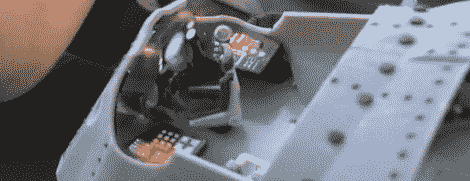

# 章鱼潜水艇是[儒勒·凡尔纳]想象不到的东西

> 原文：<https://hackaday.com/2012/10/04/octopus-submarine-is-something-out-of-jules-vernes-imagination/>

在 Reprap 或 Makerbot 上制作章鱼并没有那么难。几乎每个有 3D 打印机的 Maker Faire 展位上都有几十只这样的章鱼。这些章鱼几乎已经成为 3D 打印机新主人的通行权利，并成为与[犹他州茶壶](http://en.wikipedia.org/wiki/Utah_teapot)和[斯坦福兔子](http://en.wikipedia.org/wiki/Stanford_Bunny)相提并论的绝佳参照物。

(肖恩·查尔斯沃斯)对任何老章鱼都不满意；不，他必须制造一个更好的章鱼，还有什么更好的方法来制造一个蒸汽朋克和[[儒勒·凡尔纳]启发的模型潜艇](http://www.youtube.com/watch?v=WpOGmZzQOtw)呢？

[Sean]的 Octopod 水下打捞船几乎全部是在一台非常昂贵的打印机上打印出来的。除了几个发光二极管、电子设备和电枢导线，整个潜艇/章鱼模型是在一台 [Objet 500 Connex 打印机](http://objet.com//3d-printers/connex/objet-connex500)上打印出来的。

Objet 在大多数 3D 打印机中是独一无二的，因为它可以打印由几种类型的材料制成的对象。在[【肖恩】的展示和讲述](http://www.youtube.com/watch?v=WpOGmZzQOtw)中，他向我展示了触须是如何由一种硬塑料材料和一种可弯曲的橡胶材料制成的。[Sean]把一根金属丝穿过每个触手的长度，这样他就可以以任何想象得到的方式摆章鱼的姿势。

章鱼的外壳是一个惊人的工作量。驾驶舱的特点是微型控制，为非常小的飞行员提供照明显示器，甚至包括回收舱中的机械虹膜在内的移动部件，工作的绞盘，甚至可以打开和关闭的门。

[肖恩]在他的网站上放了一堆章鱼的迷人照片，还有一些建造过程的视频。休息之后你可以看看我采访的视频。

[https://www.youtube.com/embed/WpOGmZzQOtw?version=3&rel=1&showsearch=0&showinfo=1&iv_load_policy=1&fs=1&hl=en-US&autohide=2&wmode=transparent](https://www.youtube.com/embed/WpOGmZzQOtw?version=3&rel=1&showsearch=0&showinfo=1&iv_load_policy=1&fs=1&hl=en-US&autohide=2&wmode=transparent)[https://player.vimeo.com/video/41113291](https://player.vimeo.com/video/41113291)