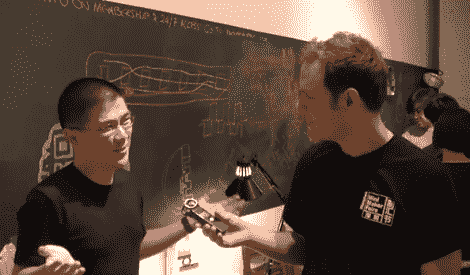

# 全球极客之旅:纽约

> 原文：<https://hackaday.com/2012/10/05/ians-global-geek-tour-new-york/>

危险原型的创始人和 Hackaday 的校友伊恩·莱斯内特再次用他的全球极客之旅取悦我们。[这一次，他访问了纽约市](http://dangerousprototypes.com/2012/10/05/global-geek-tour-new-york-2012-video/)参加开源硬件峰会、Maker Faire，并参观了纽约市的极客景点。

休息之后有一段 25 分钟的视频。[伊恩]以对[安东尼·鲍代恩]的敬意开始，但不要担心，几分钟后就平息了。今年他跳过酒店，以同样的价格在村里租了一套公寓。在调查了当地的食物供应后，他前往参加职业安全与健康峰会。采访了业内许多知名人士，还参观了一些酿酒厂的硬件和一个移动黑客空间，该空间建在一辆从克雷格列表(Craig's list)收购的旧救护车上。接下来是 Hack Manhattan 之旅，这是一个黑客空间，上面的截图就是从这里截取的。我们喜欢看到标有“废弃项目”的盒子，并惊讶地看到黑客空间正在养蜂。还有其他空间这样做吗？在去创客集市之前，伊恩逛了一些当地的商店。有一个电台小屋，Makerbot 商店，甚至陈列柜都是 3D 打印的，最后参观了一些当地的零部件商店。

我们总是被这些世界旅行视频所娱乐。这是他在韩国首尔拍的一张照片。