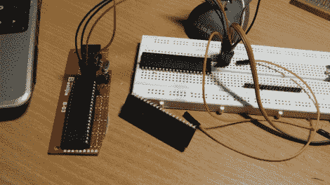

# Stcdude 是用于 STC 8051 芯片的 Linux 友好的 ISP 编程软件

> 原文：<https://hackaday.com/2012/10/05/stcdude-is-linux-friendly-isp-programming-software-for-stc-8051-chips/>

[Andrew]拿起一把大的 STC 8051 芯片来唱歌跳舞。他与他们的问题是笨重的 VB6 编程软件，只希望在 Windows 的盒子上运行。他静下心来，[编写了自己的编程软件，名为 stcdude](http://ncrmnt.org/wp/2012/10/01/stcdude-0-1-rc1-is-here/) 。正如你可能已经猜到的那样，它旨在执行与 AVR 芯片相同的开源功能。可以配合[小型设备 C 编译器(SDCC)](http://sdcc.sourceforge.net/) 使用。

它使用一个基于 Lua 脚本的 API。我们认为这是为了使你自己的硬件程序员与软件的接口变得容易。该软件包仍处于开发初期，但它正在工作，甚至实现了基于其存储的硬件数据库轮询和识别芯片类型的能力。听起来他需要帮手。必须仍然使用 stock 软件来设置 MCU 选项。我们并不真正熟悉 8051 系列，但我们敢打赌，这类似于在 AVR 芯片上设置保险丝。如果我们错了，请在评论中告诉我们。