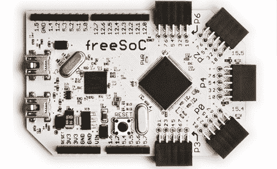

# FreeSoC，适用于需要 68 个 I/O 引脚的情况

> 原文：<https://hackaday.com/2012/10/07/freesoc-for-when-you-need-68-io-pins/>

像我们许多人一样，[Jon]用一台 Arduino 开始了他的微控制器神奇世界之旅。对于初学者来说，Arduino 是一个很棒的工具，但[Jon]很快发现自己受到了平台的限制。Arduino 上的管脚太少，而且这个平台并不适合极其复杂的项目。为此，[Jon] [设计了 freeSoC](http://www.kickstarter.com/projects/18182218/freesoc-and-freesoc-mini) ，一个基于赛普拉斯半导体 PSoC 5 的 Arduino 兼容平台。

Cypress PSoC 5 是一款功能极其强大的微控制器，具有 60 个通用 I/O 引脚和 8 个专用高电流输出。[Jon]的 freeSoC 上的每个引脚都是完全可配置的；如果你想要 24 个 SPI 端口和 12 个 20 位 ADC，只需启动 Cypress 的设计软件，以图形方式配置芯片。有了这么多的 I/O 端口，PSoC 5 就像 FPGA 一样有用，没有实际上*是*和 FPGA 的所有麻烦。

freeSoC 的一个非常好的特性是它能够图形化编程。使用 Cypress 的 PSoC Creator IDE，众多的 I/O 管脚可以非常容易地配置成任何东西。由于 PSoC 5 基于 ARM Cortex-M3，因此对 freeSoC 进行编程就像最近发布的许多 ARM 开发板一样简单。

[Jon]在这里提出了一个非常非常好的项目，这是我们肯定能看到其效用的东西。

谢谢[戴尔]送来这封信。