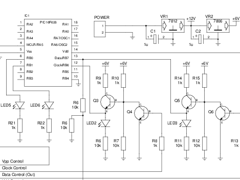

# Raspberry Pi 的 PIC 编程适配器

> 原文：<https://hackaday.com/2012/10/08/pic-programming-adapter-for-the-raspberry-pi/>

这是树莓 Pi 的另一个关于 [PIC 编程的产品。该设计试图调整 GPIO 头，使其可用于编程 PIC 微控制器，但这不仅仅是将引脚物理连接到目标芯片。大多数 PIC 系列需要 12V 编程电平，这种设置使之成为可能。](http://www.techmeology.co.uk/rpipic/)

上图所示的 NPN 晶体管组以达林顿对的形式排列。它们实际上是使用 Pi 的 3.3V 引脚切换系统内置的 6V 线性稳压器的电压。还有一个 12V 稳压器，所以你需要一个能够提供更多电源的电源。

我们以前见过类似的概念，但是这个设计更进了一步。编程器内置了几个状态 led，并支持检测哪个芯片正在被编程。到目前为止，这仅涵盖了四种不同的芯片，但我们确信它可以适应您自己的需求。

[via [Reddit](http://www.reddit.com/r/electronics/comments/113tne/pic_programmer_for_the_raspberry_pi/)