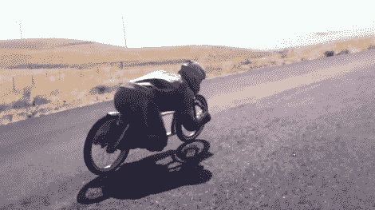

# 重力自行车

> 原文：<https://hackaday.com/2012/10/09/gravity-bike/>

这辆自行车没有踏板，也没有任何类似座位的东西。与其说这是一种四处走动的方式，不如说这是一种下来的方式。从山上下来，低到人行道上。这是由 S.I.N. Cycles 公司的人制造的重力自行车。

车架是一个长长的三角形，它拉长了轴距，为骑车人腾出了空间。在获得了正确的布局并将框架焊接在一起后，他们增加了一个相当非正统的建造步骤，即将熔化的铅倒入中空的框架管中。这辆自行车是用来在重力的作用下下山的，所以额外的重量将有助于拉得更快一点。在你上船之前，有一件事你想确定是有效的——当你进入弯道时，你需要一个前刹车。休息过后，看看视频中的一些骑行镜头。

[https://www.youtube.com/embed/b8_83fws9aM?version=3&rel=1&showsearch=0&showinfo=1&iv_load_policy=1&fs=1&hl=en-US&autohide=2&wmode=transparent](https://www.youtube.com/embed/b8_83fws9aM?version=3&rel=1&showsearch=0&showinfo=1&iv_load_policy=1&fs=1&hl=en-US&autohide=2&wmode=transparent)

[via [被黑的小工具](http://hackedgadgets.com/2012/07/27/gravity-bike-build/)