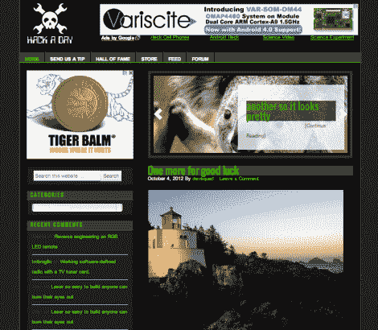

# 新的黑客日模板即将推出。这是你让它变得更好的机会！

> 原文：<https://hackaday.com/2012/10/09/new-hackaday-template-coming-soon-heres-your-chance-to-make-it-better/>

 < **编辑** —深色默认布局(如上图所示)带白色选项>

我们将很快实现一个新的模板。我们多年来一直想这么做，现在终于实现了。从网站加载速度到更好的评论，这是必要的，原因有很多。这将使用户对侧边栏中的内容有更多的控制(现在我不得不把所有的代码都放到该死的模板中！).

这是要发生的。帮助我们让它变得棒极了。

这是新模板的预览。是的，有一个白色的背景。让我们把它作为第一个问题。有人想插话说明如何使用 javascript/jquery 加载不同的 CSS 文件，以便人们可以选择深色背景吗？我已经开始研究，但我不是明星程序员。

编辑–>我们将默认为深色，并带有一个浅色选项。>

大家对评论系统怎么看？我们应该能筑巢多深？现在我认为我们有三层深度。

你更喜欢我们像现在这样做故事(图片+我们想要的任何地方的断点)，还是更喜欢我们使用摘录在首页上放更多的故事，但在你必须点击阅读之前，你只能看到预定义数量的字符？(例如: [venturebeat](http://venturebeat.com)

<**编辑**–>保持我们目前的系统大局和受控中断>

我们不会编写任何全新的系统。我们使用 wordpress，但由于我们所在的主机系统，我们甚至没有能力使用所有可用的 WordPress 插件。但是，如果您对我们如何使 hackaday 浏览更容易/更好有任何想法，请告诉我们。

我们显然不能让每个人都开心。改变总是会遇到阻力(【牛顿】第十七定律)。