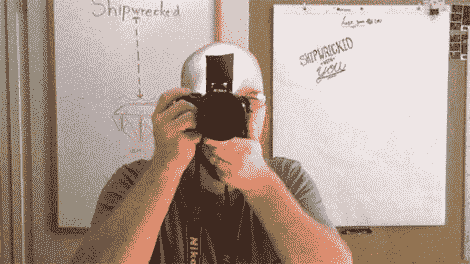

# 纸制闪光反射器

> 原文：<https://hackaday.com/2012/10/10/papercraft-flash-reflector/>

我们的傻瓜相机从不使用闪光灯。它有办法洗掉我们拍的每一张照片。但是[乔伊]对这个问题有不同的解决方法。他向我们展示了如何制作一个纸质闪光反射器，既能照亮你的拍摄对象，又不会洗掉前景中的所有东西。

[乔伊]很清楚，乍看之下，你需要一个能反光的前额才能工作。但是反射器实际上是用来将闪光灯对准天花板的。由于大多数天花板是白色的，这将把光线反射回房间，同时分散光线。他的文章包括一个模式 PDF 的链接。剪下来后，一面涂上黑色的绝缘胶带，另一面留白以反射光线。该设计包括一个标签，可以滑入他的尼康 DSLR 的热靴中，将其定位在弹出式闪光灯的前面。