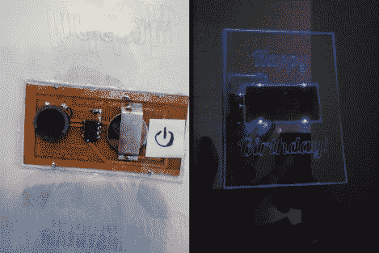

# 边缘发光音乐生日卡

> 原文：<https://hackaday.com/2012/10/10/edge-lit-musical-birthday-card/>

[Monirul Pathan]决定在准备过生日时，将卡片制作成和这份礼物一样独特。他设计并制作了自己的音乐卡片，用 LED 边缘发光丙烯酸树脂来显示信息。

电子设计力求让事物尽可能扁平。卡片形状的亚克力面板有一个空隙，可以精确地安装 PCB，元件也相对平坦。我们发现非常有趣的一点是，驱动该器件的 ATtiny85 是表面贴装的，但它不是表面贴装元件。该布局包括通孔焊盘，但不是钻孔[Monirul]剪去 DIP 引脚的多余部分，而是将剩余部分直接焊接到铜上。我们认为这不会有很大用处，所以它只需要在一天内保持在一起。

正如你在休息后的视频中看到的，演讲者播放了“生日快乐”，然后是“海底”。与此同时，四个蓝色发光二极管随着音乐跳动，照亮刻在塑料上的文字。

[https://www.youtube.com/embed/BCj4qTdPgRI?version=3&rel=1&showsearch=0&showinfo=1&iv_load_policy=1&fs=1&hl=en-US&autohide=2&wmode=transparent](https://www.youtube.com/embed/BCj4qTdPgRI?version=3&rel=1&showsearch=0&showinfo=1&iv_load_policy=1&fs=1&hl=en-US&autohide=2&wmode=transparent)