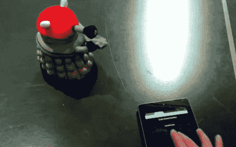

# 把一个毛绒绒的 Dalek 变成一个可以无线上网的机器人

> 原文：<https://hackaday.com/2012/10/10/turning-a-plush-dalek-into-a-wifi-enabled-robot/>

你现在可以“EX-TER-MIN-ATE！”从[开始，这个来自*神秘博士*的毛绒玩具 Dalek 就变成了一个无线机器人](http://www.madox.net/blog/2012/10/10/tl-wr703n-example-project-2-cute-exterminator-remote-control-toy/)。这个玩具的唯一诀窍是引用流行科幻电视连续剧中的话。[马多克斯]把它拆开，看看它是如何工作的，然后添加了一些他自己的好东西，使它变得更好。

我们周二刚看了这个人的一个项目。是[一个光绘棒](http://hackaday.com/2012/10/09/led-wand-brings-ergonomics-to-light-painting/)用了 TP-Link TL-WR703N 无线路由器。这与控制器使用相同的微型硬件。因为它是一个 WiFi 路由器，所以在任何浏览器上提供控制界面都非常简单。为了让这一切运转起来,[Madox]设计并印刷了一个新的基板。这提供了可以安装两个伺服电机的支架。这也给他一个地方锚定驱动板和路由器本身。原始的语音硬件仍然存在，由与路由器硬件的连接驱动。在跳转后的剪辑中看到最终产品。

[https://www.youtube.com/embed/ILpe1saMmnc?version=3&rel=1&showsearch=0&showinfo=1&iv_load_policy=1&fs=1&hl=en-US&autohide=2&wmode=transparent](https://www.youtube.com/embed/ILpe1saMmnc?version=3&rel=1&showsearch=0&showinfo=1&iv_load_policy=1&fs=1&hl=en-US&autohide=2&wmode=transparent)