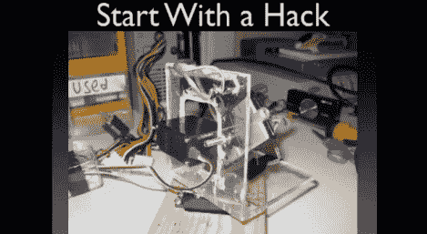

# 用微控制器激励工科学生

> 原文：<https://hackaday.com/2012/10/11/motivating-engineering-students-with-microcontrollers/>

我们在这里看到很多基于微控制器的黑客，不难看出为什么学习如何使用微控制器对未来的工程师很有价值。不幸的是，学生害怕微控制器课程，因为他们侧重于理论而不是应用。在第一节课中，[科林]向一班工程系学生讲述了如何实践微控制器。

他从一个炸弹倒计时项目的概述开始，他用这个项目学习微控制器的基础知识。这开始是一个基于 555 的计时器，但在计时和可靠性出现问题后，他最终使用了 PIC18。接下来，他讨论了一种受黑客帖子启发的彩弹哨兵枪。他完成了一些建议，并给学生们一些硬件:一台 [Pickit2](http://www.microchip.com/stellent/idcplg?IdcService=SS_GET_PAGE&nodeId=1406&dDocName=en023805&redirects=pickit2 "Pickit2") 编程器和一台[salae 逻辑分析仪](http://www.saleae.com/logic "Saleae Logic Analyzer")。

在工程中，由于过于注重理论，很容易失去动力。[Colin]关于开始构建东西的建议有望激发这些学生对微控制器的兴趣。我们也喜欢他建议学生阅读 Hackaday 的方式。休息之后，请观看讲座的完整视频。

[https://www.youtube.com/embed/vJ78AB4fp_k?version=3&rel=1&showsearch=0&showinfo=1&iv_load_policy=1&fs=1&hl=en-US&autohide=2&wmode=transparent](https://www.youtube.com/embed/vJ78AB4fp_k?version=3&rel=1&showsearch=0&showinfo=1&iv_load_policy=1&fs=1&hl=en-US&autohide=2&wmode=transparent)