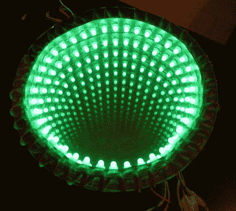

# 凝视这个光线充足的互动无限镜

> 原文：<https://hackaday.com/2012/10/11/stare-deep-into-this-well-lit-interactive-infinity-mirror/>

[acorv]最近给我们发了一个链接，链接到他制作的一个很酷的互动无限镜([翻译](http://translate.google.com/translate?sl=auto&tl=en&js=n&prev=_t&hl=en&ie=UTF-8&layout=2&eotf=1&u=http%3A%2F%2Fmesalioasi.blogspot.com%2F2012%2F07%2Fespejo-infinito-interactivo.html&act=url))。他最初有点害怕把项目交给我们，但我们的[最近的 Reddit AMA](http://www.reddit.com/r/IAmA/comments/1174qy/im_caleb_kraft_senior_editor_at_hackadaycom/) 启发[acorv]通过我们的提示行提交它，我们很高兴他这样做了。

幸运地从 Sparkfun 的 2012 年免费日获得了 100 美元的装备，他拿起了一对可寻址的 LED 灯条和一个 Teensy++。他用反光箔制作了一个 LED 环，将这些条带夹在一面镜子和一块镜面玻璃之间。最终的无限远镜子看起来很不错，但是[acorv]想让静态显示更有趣一点。

他在镜子的框架上添加了一个红外接收器和超声波测距仪，使他既可以远程控制显示器，又可以检测到何时有人站在附近。正如你在下面的视频中看到的，[acorv]可以心血来潮地改变图案，当有人停下来仔细查看时，镜子会加快显示速度。

[vimeo http://vimeo.com/45364766 w=470]