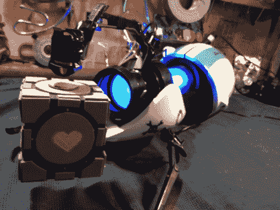
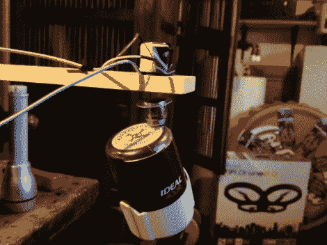
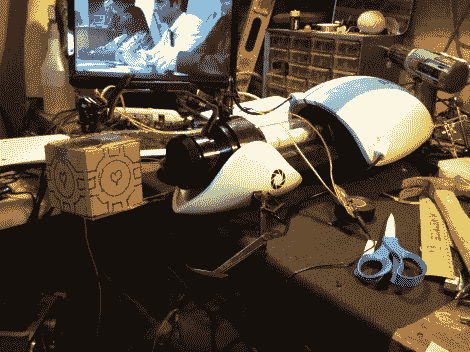
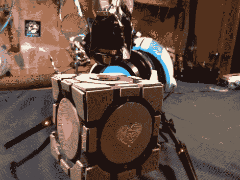

# 哈卡戴的传送门枪实际上悬浮了一个同伴立方体

> 原文：<https://hackaday.com/2012/10/11/hackadays-portal-gun-actually-levitates-a-companion-cube/>

[https://www.youtube.com/embed/LZkApleQQpk?version=3&rel=1&showsearch=0&showinfo=1&iv_load_policy=1&fs=1&hl=en-US&autohide=2&wmode=transparent](https://www.youtube.com/embed/LZkApleQQpk?version=3&rel=1&showsearch=0&showinfo=1&iv_load_policy=1&fs=1&hl=en-US&autohide=2&wmode=transparent)

我和几个朋友出去吃午饭，就一些有趣的项目集思广益，其中一个朋友说“如果我们能造一个能工作的重力枪，那不是很酷吗？”。我们立即一致认为，虽然这实际上很酷，但也是一个愚蠢的提议。然而，仅仅几秒钟后，我意识到我们可以很容易地做一个模仿这个概念的展示作品。浮动磁球已经存在很长时间了。

我决定把漂浮地球仪的内脏扯出来，装在传送门枪上，因为它们比重力枪更容易找到。我还会建立一个自定义的伴侣立方体，以正确的大小和重量的必要。

**悬浮系统**

我从 StellaNova 磁悬浮球开始。我选择了大约 8 英寸的较大版本。我的假设是，这一个将能够容纳更多的重量比较小的版本。

将线圈从金属框架中撬出来很困难，实际上导致了一个损坏的线圈，我不得不修复它。如果你要复制这一点，我建议从框架上切下包含线圈的整个金属外壳，而不是试图只移除线圈。

一旦我把线圈取出来，我就把地球仪顶部的强磁铁扯了出来。这个地球仪实际上在底部有一块磁铁，帮助它在悬浮过程中保持稳定，所以我知道我必须调整我的同伴立方体，以获得恰到好处的重量。如你所见，我的过程是纯科学的，极其精确。

**传送门枪**

我真的很想为此制作自己的传送门枪。我的时间表和我的自我在这个问题上进行了激烈的斗争，最终我的时间表赢了。虽然我觉得我可以建造一个神奇的传送门枪，但我不可能在合理的时间内完成它，并获得像在玩具店购买传送门枪道具一样好的结果。

当最初在枪上安装线圈时，我发现“手臂”太灵活了。我必须想办法加固手臂。我选择的方法是简单地将一块钢弯曲成正确的形状，然后绑在“手臂”的下面。

我做了一个纸板模型来测试同伴立方体的重量和大小，并让系统在门炮上工作。

**立方体**

在这一点上，整个事情正在工作。我太兴奋了，以至于等不及商店买的立方体到来，并试图让它达到正确的重量。前提是我能找到一个合适的尺寸。所以，我用泡沫做了自己的。诚然，它不是世界上最好看的同伴立方体。如果我要更进一步，我可能会雕刻一个并制作一个模具，这样我就可以制作我自己的固体泡沫伴侣立方体。

**一个巨大的进步:**

我一开始以为最终产品会是一把传送门枪，你可以拿着它悬浮一个立方体。这意味着我需要把悬挂漂浮立方体的线圈安装到入口枪上。在视频中可以看到，这是一个相当明显的修改。你可以看到门炮上臂的线圈、电线和钢筋。然而，当它建成后，我发现我不能让它保持静止来维持悬浮。

既然拿着它是不可能的，我意识到我可以用一种更美观的方式来做这件事。我没有使用那种将磁铁悬挂在线圈下方的悬浮地球仪，而是使用了一种带有磁性底座的悬浮地球仪，将磁铁悬浮在线圈上方的悬浮地球仪。这将使传送门枪完全不被修改。

**感谢**

我想特别感谢密苏里州斯普林菲尔德的[古董商](http://www.vintagestock.com)(格伦斯通的那家)，他让我把这个系统带进来并展示了一下，直到霍尔效应传感器最终被砸了太多次，立方体无法漂浮起来。