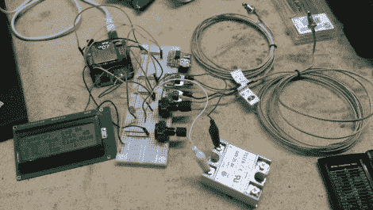

# 建立一个更好的 PID 吸烟控制器

> 原文：<https://hackaday.com/2012/10/11/building-a-better-pid-smoker-controller/>

[Matt]想要更好地控制他的熏肉机，所以[他建造了这个先进的 PID 熏肉机控制器](http://mhkaufman.blogspot.com/2012/10/fancier-smoker-controller.html)。它使用图片右下角的固态继电器来开关吸烟者的加热元件。但是包含的所有其他好东西增加了一些在这些版本中不常见的特性。

这是他在最初版本上使用的商用 PID 单元的替代品。它监控吸烟者的温度，使用预测算法来保持合适的热量水平。但这一次[马特]正在寻找额外的反馈，用第二个传感器来监控肉类温度。使用带有 SD 屏蔽的 Arduino，他能够记录吸烟过程的数据，他的自定义代码允许他指定温度曲线，以便在肉类达到目标温度后将其静置。这让我们想起了[回流焊炉控制器](http://hackaday.com/2011/11/24/toaster-oven-reflow-control-without-modifying-the-oven/) …但是是为了食物。