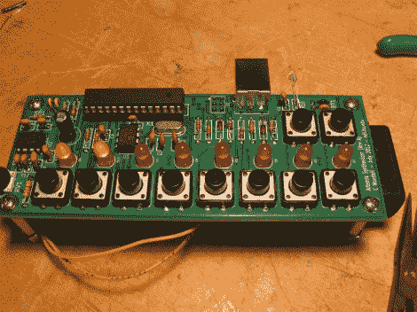

# Artemis 合成器套件

> 原文：<https://hackaday.com/2012/10/13/artemis-synthesizer-kit/>

Artemis 合成器 T1 是作为波斯顿大学 T2 Artemis 项目 T3 的一个工具包而制造的。该项目旨在通过动手实践活动向即将升入高中的女性新生传授计算机科学知识。[Chris]该套件基于 ATMEGA328P 微控制器和 MCP4921 数模转换器。它可以在键盘模式下使用，其中按钮切换音阶的各种音符，或者在音序器模式下使用，其中按钮用于切换预编程的序列。

[Chris]希望学生在研讨会结束后可以使用该套件，所以他使用了一个名为“光加载器”的光学链接将新的序列和波形编程到该设备中。基于 web 的应用程序允许在浏览器中构建波形和序列，然后通过将光电晶体管举到闪烁的方块上进行编程。对应于一个[双相标志码](http://en.wikipedia.org/wiki/Differential_Manchester_encoding "Biphase Mark Code")编码信息，正方形闪烁黑色和白色。这由合成器上的微控制器解码并存储在存储器中。因此，不需要特殊的硬件来播放新的波形和序列。

[Chris]为这个项目写了一份详尽的报告，包括学生的反馈调查。他计划在未来添加更多关于 Optoloader 的具体信息。

休息之后，请观看该工具包的运行视频。

[https://www.youtube.com/embed/ljBx9qjmdTc?version=3&rel=1&showsearch=0&showinfo=1&iv_load_policy=1&fs=1&hl=en-US&autohide=2&wmode=transparent](https://www.youtube.com/embed/ljBx9qjmdTc?version=3&rel=1&showsearch=0&showinfo=1&iv_load_policy=1&fs=1&hl=en-US&autohide=2&wmode=transparent)