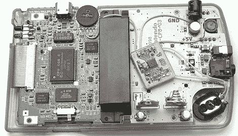

# 让游戏男孩的颜色更响亮

> 原文：<https://hackaday.com/2012/10/13/making-a-game-boy-color-louder/>

当[安东]拿起一个旧的半透明紫色游戏机时，他注意到扬声器几乎完全没有声音。这根本做不到，所以[Anton]更换了扬声器，并焊接了一个 2 瓦的放大器，使他的游戏机声音非常大。

打开他的游戏机后，[安东]注意到扬声器生锈了。他换上了一个摩托罗拉手机的扬声器，解决了最紧迫的问题。插上几节电池后，他仍然注意到几乎完全没有声音。

转向他的电子垃圾抽屉，[安东]拿出一个[TI TPA 2000D 1D 类放大器](http://www.ti.com/product/tpa2000d1)。这个微型放大器能够为一个扬声器提供 2 瓦的功率，鉴于它的 D 级血统，它是非常节能的。

在制作了 PCB 并将放大器连接到游戏机的电路板后，[安东]花了一点时间追踪一些高频嘶嘶声的来源。事实证明，一个 15 岁的游戏机上的电源调节器和转换器并不是最高质量的，但在添加了几个电容器后，[安东]一切都得到控制。

现在[安东]的游戏男孩有非常响亮，清晰的声音。考虑到 chiptune 艺术家修改旧的“砖块”风格游戏男孩与[小声音 DJ](http://littlesounddj.com/lsd/) 或 [nanoloop](http://www.nanoloop.com/) 一起使用的时间长度，对于寻求更多*魅力*的音乐家来说，[安东]的构建可能成为一个值得的修改。