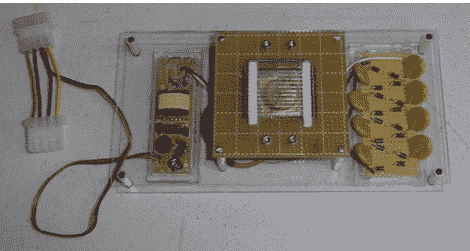

# 廉价的α粒子火花探测器

> 原文：<https://hackaday.com/2012/10/15/cheap-spark-detector-for-alpha-particles/>

[JAC_101]写信告诉我们，真正疯狂的科学家的 LVL1 分裂小组刚刚建造了一个简单的[阿尔法粒子探测器](http://wiki.lvl1.org/Alpha_Spark_Detector)。探测器是由电离辐射触发的高压 DC 火花隙。制造一个这样的探测器需要为一些高压交流电耗尽冷阴极电源，然后用一个[科克罗夫特-沃顿发电机](http://en.wikipedia.org/wiki/Cockcroft%E2%80%93Walton_generator)将那个电源提升到疯狂的高压 DC。我们被告知，一旦火花隙的距离被仔细调整，它就会随着放射源的引入而明亮地发光。没有视频，甚至没有运行的图片，但是我们发现[这个](https://carlwillis.wordpress.com/2011/09/17/a-simple-spark-detector-for-alpha-particles/)非常酷。也许所有的火花隙相关的射频杀死了他们的相机或什么，他们的网页至少承诺视频很快。

与此同时，看看真正疯狂的科学家的 LVL1 分裂集团的电离[云室](http://hackaday.com/2012/09/24/an-actively-cooled-cloud-chamber/)更多的放射性乐趣。