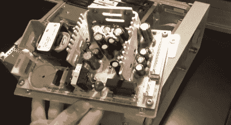

# 修理废弃的信号发生器

> 原文：<https://hackaday.com/2012/10/15/repairing-a-junked-signal-generator/>

我们肯定走过了错误的垃圾箱，因为我们肯定没有遇到过像这样等待被打捞的设备。[Shahriar]在“翻垃圾箱”的时候发现了一个 HP 8648C 合成信号发生器，然后[着手修复发生故障的实验室设备](http://thesignalpath.com/blogs/2012/10/07/teardown-and-repair-of-an-hp-8648c-synthesized-signal-generator/)。他在这个项目上发布了一个 1 小时的视频，你可以在休息后找到嵌入的视频。实际修复发生在前半部分，视频的其余部分用于测试复活的设备。

箱子的后角有凹痕，这可能是它被扔掉的原因。当它第一次通电时，它会发出令人不快的刺耳噪音，用户界面不会做任何事情。[Shahriar]说他认为这个声音是一个故障的开关模式电源。果然，当从主板上断开时，它仍然发出噪音。原来有一个巨大的电解电容器，有一堆扑克筹码那么大，已经从 PSU 板上松脱了。当它重新排序时，该设备如预期的那样启动。

现在，我们如何找到一个只需要重新组装 PSU 的数字捕获示波器呢？

[https://www.youtube.com/embed/4_Gd0W5bGYY?version=3&rel=1&showsearch=0&showinfo=1&iv_load_policy=1&fs=1&hl=en-US&autohide=2&wmode=transparent](https://www.youtube.com/embed/4_Gd0W5bGYY?version=3&rel=1&showsearch=0&showinfo=1&iv_load_policy=1&fs=1&hl=en-US&autohide=2&wmode=transparent)