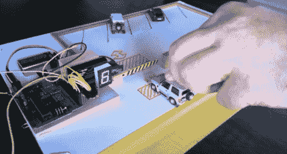

# Arduino 停车场服务员

> 原文：<https://hackaday.com/2012/10/15/arduino-parking-lot-attendant/>

这是玩具车的自动停车门。没有必要按下按钮，电子设备会检测大门两侧是否有车辆，在确认停车场没有装满后，会将车辆升起。这和[计算有多少人进入房间来开灯](http://hackaday.com/2012/09/19/home-automation-hack-controls-lights-based-on-head-count/)的想法是一样的，但是硬件有点不同。

该系统由作为停车场的纸中的一对传感器控制。有三张厚纸，上面和下面都有铝箔，中间一层作为隔板。分离器上有孔，上面可以看到散列标记。当你把车开到门口时，给车增加一点压力，这就完成了一个电路，指示 Arduino 有一辆车在适当的位置。

在休息之后的两个视频中，你可以看到一个演示，以及构建的内部结构。

[https://www.youtube.com/embed/1u8XtnU97Xo?version=3&rel=1&showsearch=0&showinfo=1&iv_load_policy=1&fs=1&hl=en-US&autohide=2&wmode=transparent](https://www.youtube.com/embed/1u8XtnU97Xo?version=3&rel=1&showsearch=0&showinfo=1&iv_load_policy=1&fs=1&hl=en-US&autohide=2&wmode=transparent)

[https://www.youtube.com/embed/4mJC-9UPDFw?version=3&rel=1&showsearch=0&showinfo=1&iv_load_policy=1&fs=1&hl=en-US&autohide=2&wmode=transparent](https://www.youtube.com/embed/4mJC-9UPDFw?version=3&rel=1&showsearch=0&showinfo=1&iv_load_policy=1&fs=1&hl=en-US&autohide=2&wmode=transparent)

[通过 [Reddit](https://pay.reddit.com/r/arduino/comments/11i7o7/diy_toy_car_park_access_system_with_arduino/) 通过 [Freetronics](http://www.freetronics.com/blogs/news/6727100-diy-miniature-car-park-access-system-with-arduino#.UHxJ2rRpXSF)