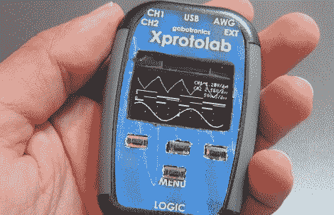

# 微型有机发光二极管示波器得到一个奇特的情况

> 原文：<https://hackaday.com/2012/10/16/tiny-oled-oscilloscope-gets-a-fancy-case/>

[Gabriel Anzziani]刚刚发布了一款更新、更方便的 Xprotolab 便携式示波器、逻辑分析仪和函数发生器。它在 Kickstarter 上[上涨，对于这种口径的工具来说，价格实际上非常不错。](http://www.kickstarter.com/projects/920064946/xprotolab-portable)

我们第一次看到 Xprotolab [是在去年早些时候](http://hackaday.com/2011/02/17/xprotolab-oscilloscope-and-xmega-development-board/)和[在今年的纽约世界创客大会上偶遇【Gabriel】](http://hackaday.com/2012/09/30/tiny-oled-o-scope-fits-on-a-breadboard/)。在这两个场合，我们都被这个非常非常小的有机发光二极管显示示波器和通用试验板瑞士军刀的尺寸和性能所打动。

Xprotolab 具有一个双通道、200 kHz 示波器、8 输入逻辑分析仪和一个任意波形发生器，应该足以满足您所有的试验板冒险。最重要的是，Xprotolab 可以嗅探 SPI、I2C 和 UART 协议，甚至在一个小到可以放在口袋里的设备中隐藏了一个小型频谱分析仪。

为 Kickstarter Xprotolab 更新的产品采用了一个带有 LiPo 电池的外壳，每次充电可使用 12 小时。当然，这不是一个摆满旧惠普和泰克设备的工作台，但对于崭露头角的制造商来说，这似乎确实是一个非常有用的工具。