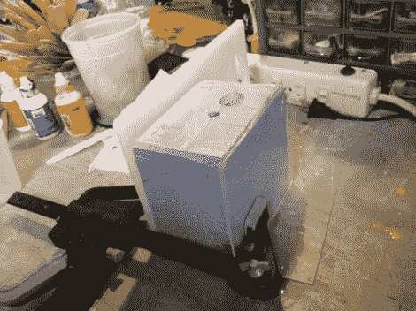

# 通过制作自己的模具来复制 3D 打印模型

> 原文：<https://hackaday.com/2012/10/17/reproduce-3d-printed-models-by-making-your-own-molds/>

需要 50 份你引以为豪的 3D 打印旋转木马吗？通过使用 3D 打印模型制作模具来铸造副本可能会更快。[弥迦]发现自己在这种情况下，并设法使用上面看到的模具每 10-12 分钟铸造一个副本。

有了目标在手，你需要找到一个容器，将适合模具，没有太多的浪费。然后在模具的下半部分填充建模粘土，一些形状独特的物体作为钥匙，以及模型本身。在获得良好的脱模剂涂层后，模具的其余部分被填充用于模具制造的硅橡胶产品。这就形成了模具的一半。在它固化粘土和关键物体被移除后，所有东西都被喷上脱模剂，然后另一半模具被浇注。

现在你的 3D 物体可以通过将两部分树脂倒入闪亮的新模具中来复制。