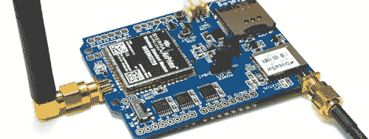

# 将 GPS、GSM 和 SD 卡放入 Arduino 保护罩中

> 原文：<https://hackaday.com/2012/10/19/stacking-gps-gsm-and-an-sd-card-into-an-arduino-shield/>

几年前，一个客户问[Phang Moh]和他的同胞，他们能否为印度尼西亚各地的油轮制造一种车辆跟踪装置。在炸药罐上安装数千个跟踪器的要求有点超出了[Phang Moh]的能力，但他确实开始在 Arduino 上摆弄 GPS 和 GSM。

现在，修补终于有了成果，有了[Phang]的[TraLog shield](http://www.rocketscream.com/blog/2012/10/17/vehicle-tracking-logging-using-tralog-shield/)，这是一个单一的 Arduino shield，将 GPS 跟踪与 GSM 和 GPRS 收发器结合在一起。此外，还有一个 SD 卡，使其成为 Arduino 最好的跟踪和数据记录屏障之一。

这个盾牌可以被配置成将 GPS 和传感器数据从连接到 I2C 总线的设备发送到远程服务器，或者一个非常酷的 COSM 服务器。[Phang]正在以 150 美元的价格出售他的 TraLog，如果你考虑这东西能做什么，这是一笔相当不错的交易。

似乎是任何跟踪项目的完美工具，无论你想知道数千艘油轮的位置还是一个高空气球的位置。

为找到这个向[布雷特]脱帽致敬。