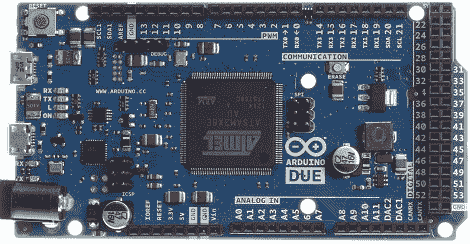

# Arduino 到期日终于到了

> 原文：<https://hackaday.com/2012/10/20/the-arduino-due-is-finally-here/>

经过多年的等待，ARM 驱动的 Arduino 终于问世了。Arduino 将于本周一发布。

Arduino Due 的板载是一个来自 Atmel 的 ARM Cortex M3 微控制器，运行频率为 84 MHz。Due 有一系列令人印象深刻的功能，包括 USB 2.0 主机，与 Android ADK 的兼容性(以免[你仍然需要一个 IOIO](http://hackaday.com/tag/ioio/) )，12 个 12 位分辨率的模拟输入，2 个 12 位运行的模拟*输出*，一个 CAN 接口，以及比你可以摇动一根棍子更多的输入引脚。

要获得完整的功能列表，你可以[获取我们在](http://hackaday.com/wp-content/uploads/2012/10/due.pdf)[纽约 Maker Faire】上看到的 PDF](http://hackaday.com/2012/10/03/finally-an-arm-powered-arduino/)

Arduino 平台的这一硬件更新使得许多非常酷的构建成为可能，甚至对于初学硬件的黑客也是如此。当然，Due 将用于控制无人机和无人机，激光切割机和 3D 打印机，并从模拟输出中播放 WAV 文件。大幅改进的硬件开辟了许多其他可能的构建，包括制作自己的吉他踏板——DSP 是一个很棒的东西——以及通过 CAN 总线实时读取来自汽车的遥测数据。

虽然现在还没有，但你可以在下周一在你最喜欢的电子产品零售商那里以 49 美元的价格买到 Arduino。 **