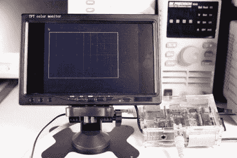

# 使用 Pygame 的 RPi 视频

> 原文：<https://hackaday.com/2012/10/20/rpi-video-with-pygame/>

Adafruit 有一个关于用 RPi 和 pygame 制作视频的新教程。目标是在低成本的硬件上创建定制的用户界面，由易于使用的 pygame 库提供支持。本教程介绍了如何设置 RPi 来运行 pygame，创建一个控制帧缓冲区的基本 pygame 脚本，并在屏幕上绘制示波器显示。

本教程使用 Adafruit 的 [WebIDE](http://hackaday.com/tag/web-ide/ "WebIDE") 作为开发环境。对于处理视频显示来说，这是一个极好的解决方案，因为您可以在联网的计算机上开发代码，并在运行图形应用程序的同时查看外壳。这对于调试非常有用，因为您可以将信息打印到 WebIDE 控制台。

这个装置有很大的潜力。它非常适合创建任何 kiosk 应用程序。可能是公告显示、交互式信息亭，甚至是可编程逻辑控制器类型的用户界面？将 RPi 连接到 LCD 触摸屏上，您还能制作什么？

休息之后，请观看 Adafruit 的展示视频。

[https://www.youtube.com/embed/Yj0gxhUTqbw?version=3&rel=1&showsearch=0&showinfo=1&iv_load_policy=1&fs=1&hl=en-US&autohide=2&wmode=transparent](https://www.youtube.com/embed/Yj0gxhUTqbw?version=3&rel=1&showsearch=0&showinfo=1&iv_load_policy=1&fs=1&hl=en-US&autohide=2&wmode=transparent)