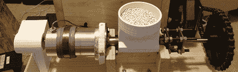

# 最后，将塑料颗粒变成 3D 打印机细丝

> 原文：<https://hackaday.com/2012/10/22/finally-turning-plastic-pellets-into-3d-printer-filament/>

情况是这样的:一公斤 3D 打印机细丝的成本约为 50 美元。一公斤塑料颗粒的成本不到十分之一。有人有解决这个问题的办法吗？

多年来，普遍的共识是在家里制作自己的 3D 打印机灯丝几乎是不可能的，要应对家庭制造的机器根本无法应对的温度、压力和公差。[Bradley]送来了一台他自己做的细丝挤压机,因为他对目前桌面细丝工厂有巨大的技术问题需要克服的心态感到不安。

[Bradley]的挤压机基于 [Lyman 细丝挤压机](http://www.thingiverse.com/thing:30642)，这种机器已经成功地展示了将塑料颗粒成型为细丝，并将这种细丝用于 3D 打印零件的生产。[布拉德利]的改进包括一个变速电机，一个更大的热端，以及一个自动定时系统，以生产设定数量的打印机细丝。

当然，既然 Inventables 投入了 40，000 美元来解决在家里制造灯丝的问题，肯定会有不少成功的设计走向公众。当我们上次报道家用灯丝制造的发展时，[的灯丝机器人](http://filabot.com/)似乎处于领先地位。现在，随着布拉德利(和莱曼)的机器生产出可用的灯丝，40 英镑的大奖被抢走只是时间问题。