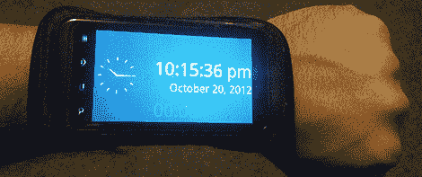

# 我们离真正的皮普男孩就差这么一点点了

> 原文：<https://hackaday.com/2012/10/22/were-this-close-to-a-real-pip-boy/>

无论是受到*辐射*的启发，还是受到【特朗嘉·莉拉】佩戴的神秘手腕设备的启发，我们都很高兴看到终于有人[做出了一款手腕佩戴的手机](http://blog.theultimatelabs.com/2012/10/android-phone-wrist-watch.html)，

创造者[Rob]称之为终极腕表，是基于他的摩托罗拉 Defy 智能手机，塞在一个经过巧妙改造的 iPod 腕带中，用于容纳跑步者的音乐播放器。简单地将手机戴在手腕上会有点尴尬，而且会极大地消耗电池寿命，所以[Rob] [编写了一个应用程序](https://play.google.com/store/apps/details?id=com.theultimatelabs.watch)，当加速度计检测到手机处于正确的手表读取位置时，它会自动打开显示屏，当[Rob]再次放下手臂时，它会关闭显示屏。

目前，终极腕表仅具备标准腕表的功能——时间、日期、计时器和秒表是目前仅有的功能。尽管如此，这还是危险地接近了我们长期以来被承诺的腕戴式电脑。

你可以在[Rob]的 git 上获取终极腕表的源代码，或者直接从 Google Play 下载。休息过后，看看终极腕表的视频。

[https://www.youtube.com/embed/LxUduZR78c0?version=3&rel=1&showsearch=0&showinfo=1&iv_load_policy=1&fs=1&hl=en-US&autohide=2&wmode=transparent](https://www.youtube.com/embed/LxUduZR78c0?version=3&rel=1&showsearch=0&showinfo=1&iv_load_policy=1&fs=1&hl=en-US&autohide=2&wmode=transparent)