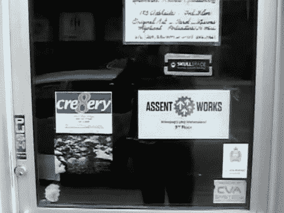

# 黑客空间简介:温尼伯的 Skullspace 和 AssentWorks

> 原文：<https://hackaday.com/2012/10/22/hackerspace-intro-skullspace-and-assentworks-in-winnipeg/>

前门上的标志可能有点小，但 AssentWorks 和 Skullspace 所居住的空间却一点也不小。[Matt]带我们参观加拿大温尼伯的 makerspace 和 hacker space。

这两个空间占据了建筑的一层，但被分隔成不同的用途。AssentWorks 被称为创客空间，是一个企业孵化器。参观显示它是一个大而整洁的区域，小企业可以集中资源来维护和储存各种商店和工作区。我们不禁认为它是一个 OSB 丛林，因为似乎所有的内墙都是由定向刨花板建造的。

视频的第二部分展示了黑客空间:Skullspace。这是少得多的抛光，但显示了很多承诺。有几个电子、机械加工和木工的工作空间。还有一个拱廊室，一个教室，和一些其他产品。两者之间总共有 8350 平方英尺的空间。

休息后可以看到嵌入的十分钟游览。

[https://www.youtube.com/embed/TtBdpJ14oLk?version=3&rel=1&showsearch=0&showinfo=1&iv_load_policy=1&fs=1&hl=en-US&autohide=2&wmode=transparent](https://www.youtube.com/embed/TtBdpJ14oLk?version=3&rel=1&showsearch=0&showinfo=1&iv_load_policy=1&fs=1&hl=en-US&autohide=2&wmode=transparent)