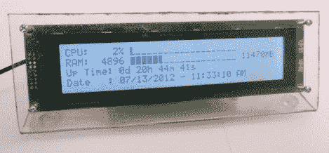

# 使用自定义 HID 代码驱动 LCD 字符显示器

> 原文：<https://hackaday.com/2012/10/23/driving-an-lcd-character-display-using-custom-hid-codes/>

这是一个外部显示器，旨在帮助您跟踪电脑的状态。它通过 USB 连接，由 PIC 微控制器驱动。它监听一小组命令，用这些命令实现简单的控制协议来驱动屏幕。

[Andrew Gehringer]围绕 PIC 18F2550 设计了该设备，它提供本机 USB 控制。他在用 Microchip 的 USB 堆栈将模块枚举为 HID 设备。它监听命令 0x10 到 0x23。这些操作清除显示器，将字符串写入显示器的四行中的每一行，并切换 LCD 背光。当然，这个项目包括一个[Andrew]编写的程序来支持显示。它有一个 GUI，让他决定显示什么信息以及如何格式化。这个助手应用挂在系统托盘上，方便访问。