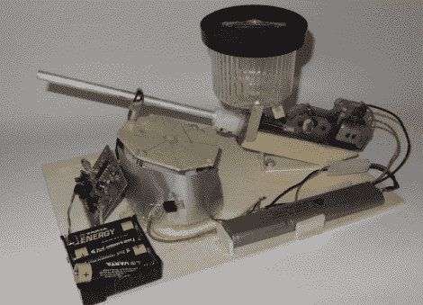

# 自动气枪炮塔

> 原文：<https://hackaday.com/2012/10/25/automatic-airsoft-turret/>

[瓦伦丁]写信告诉我们他的自动气枪炮塔。它缺乏准确性，但它的巨大火力弥补了这一不足。弹丸容器能够容纳 500 个 6mm 的 bbs，所以确保在这个设备装备后离开。

该设备本身就是物理黑客的一个很好的例子，从运动传感器以及气枪的 G35 变速箱中收集零件。对于物理旋转，它使用了一个令人想起无用机器工作方式的反向平台(更多无用机器信息见[this【HAD】文章](http://hackaday.com/2009/12/30/simplest-most-useless-machine/ "useless machine"))。即使你对建造炮塔不感兴趣，这台机器也采用了一些非常有趣的概念，所以值得一试。

当真人团队堡垒成为一种时尚时，也许这些会出现。在此之前，请查看休息后的这个炮塔的视频，或者查看[原文](http://www.doityourselfgadgets.com/2012/10/motion-activated-airsoft-turret.html "Automatic airsoft turret")获取更多图片和视频！

[https://www.youtube.com/embed/fUcjxT6nilU?version=3&rel=1&showsearch=0&showinfo=1&iv_load_policy=1&fs=1&hl=en-US&autohide=2&wmode=transparent](https://www.youtube.com/embed/fUcjxT6nilU?version=3&rel=1&showsearch=0&showinfo=1&iv_load_policy=1&fs=1&hl=en-US&autohide=2&wmode=transparent)