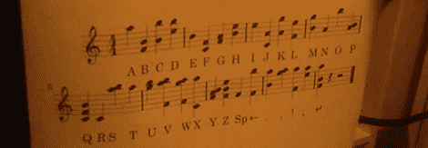

# 使用 MIDI 架子鼓键入

> 原文：<https://hackaday.com/2012/10/25/typing-with-a-midi-drum-set/>

[奥廷]18 岁开始打鼓，但他自己承认他不是[邦佐]、[巴迪·里奇]或[林戈]。练习似乎总是落在他的待办事项清单的末尾，而通往卡内基音乐厅的路真的只有一条。有一件事[Autuin]非常擅长，那就是打字，所以他认为他可以通过敲出几段来提高他的打鼓技巧。

构建的核心是一个雅马哈 DTX 鼓模块，一个 MIDI 到 USB 适配器，和一点点轻编码。基本上，[Autuin]用他的鼓做了一个和弦键盘；通过同时敲击一个(或两个，或三个)鼓面，他可以在开放式办公室中键入字符。

对于走出稳定摇滚节奏的舒适区，我们认为[Autuin]的构建可能只是有用的。他将在温哥华东区文化巡回展上展示他的键盘/鼓混搭作品和[一起，这是一个具有艺术价值的可怕装置](http://hackaday.com/2012/07/29/building-the-most-offensive-video-game-ever/)。如果你保证不打破任何东西，几周后去拜访他。

休息后的维迪亚。

[https://www.youtube.com/embed/ERSP-g7Qr1c?version=3&rel=1&showsearch=0&showinfo=1&iv_load_policy=1&fs=1&hl=en-US&autohide=2&wmode=transparent](https://www.youtube.com/embed/ERSP-g7Qr1c?version=3&rel=1&showsearch=0&showinfo=1&iv_load_policy=1&fs=1&hl=en-US&autohide=2&wmode=transparent)