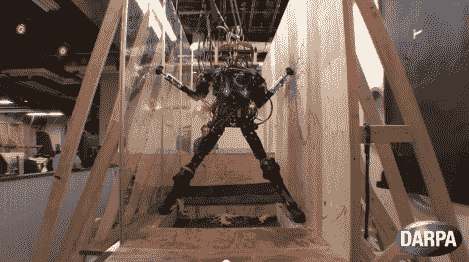

# DARPA 资助的机器人忍者战士？

> 原文：<https://hackaday.com/2012/10/26/darpa-funded-robot-ninja-warrior/>

游戏节目《忍者战士》的粉丝会立刻认出这个测试装置与蜘蛛攀爬的相似之处。当然那不是人类参赛者，而是[波士顿动力](http://www.youtube.com/watch?v=FFGfq0pRczY)研发的人形机器人。它实际上并不把垂直的墙壁作为唯一的支撑。两边有两个狭窄的壁架，它的脚可以在上面站稳。尽管如此，这是一些令人印象深刻的工作，以保持直立，避免滑倒。休息之后看看视频，看看效果如何。

这家公司推出的令人惊叹的机器人技术数量惊人。就在上个月，我们看到了机器猎豹 T1，它能以大约 30 英里/小时的速度奔跑。我们不希望在野外很快看到它们，但尤其是这个人形机器人。你会注意到仪器周围的红色圆环。我们相信这些是为给机器人位置反馈而设置的高速摄像机，我们打赌没有它们它就不能工作。但这仅仅是猜测，你自己判断吧。

[https://www.youtube.com/embed/FFGfq0pRczY?version=3&rel=1&showsearch=0&showinfo=1&iv_load_policy=1&fs=1&hl=en-US&autohide=2&wmode=transparent](https://www.youtube.com/embed/FFGfq0pRczY?version=3&rel=1&showsearch=0&showinfo=1&iv_load_policy=1&fs=1&hl=en-US&autohide=2&wmode=transparent)

[感谢 Pdadio via [极客](http://www.geekologie.com/2012/10/were-all-dead-darpas-human-like-robot-le.php)