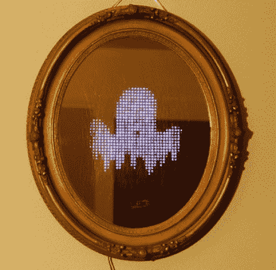

# 万圣节道具:一面怪异的镜子

> 原文：<https://hackaday.com/2012/10/26/halloween-props-a-spooky-mirror/>

 

这面[镜子会用各种静态和动态图像惊吓你的客人](http://www.instructables.com/id/Android-Haunted-Mirror)。它包括一个接近传感器，所以图像不会出现，直到有人靠近到足以在镜子中看到自己。

电子零件很容易组装起来。镜子背面安装了一个 32×32 RGB LED 矩阵。它由一个 IOIO 板驱动，带有一些由[Ytai]编写的定制固件，该板的创建者恰好住在[Alinke]的隔壁。这开始变得有趣是当[Alinke]在镜子上工作，使发光二极管从前面可见。他用剃刀在背面的清漆上划了数百道划痕。这使得刚好足够的光通过看到发光二极管，但保持镜面反射。休息后在片段中自己看吧。

图像由一个 Android 设备传送到 IOIO 板上。我们认为这在万圣节后会有很大用处，可以作为天气预报或新闻播报。也许你甚至可以用你的 diy 机器人恒温器来喂养它。

[https://www.youtube.com/embed/NFGkdMtI8jI?version=3&rel=1&showsearch=0&showinfo=1&iv_load_policy=1&fs=1&hl=en-US&autohide=2&wmode=transparent](https://www.youtube.com/embed/NFGkdMtI8jI?version=3&rel=1&showsearch=0&showinfo=1&iv_load_policy=1&fs=1&hl=en-US&autohide=2&wmode=transparent)