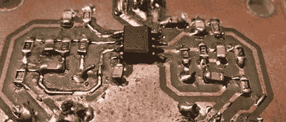

# 为第一个电子项目制作唱机前置放大器

> 原文：<https://hackaday.com/2012/10/27/making-a-phono-preamp-for-a-first-electronics-project/>

几乎每个人的第一个电子项目都是让 LED 闪烁的东西。有一百万种方法可以实现这个电子设计的“Hello World”项目；555 个定时器、微控制器，如果你真的很酷，甚至可能是分立元件。当[miceuz]被一个朋友要求帮助他的第一个电子项目时，他避开了通常的闪烁 LED 项目，并教他如何建造他真正需要的东西:[一个旧转盘的唱机前置放大器](http://wemakethings.net/2012/09/21/phono_preamp/)。

回到黑胶唱片为王的时代，需要掌握专辑才能在唱机上播放。母带制作过程会削减一些低音，增加高音。当播放唱片时，这个过程需要反过来。它是一个前置放大器，通过衰减高频声音和增强低音来完成这项工作。

[miceuz]找到了一个不错的 DIY RIAA 前置放大器项目，并在他的零件箱的某个地方为[找到了一个不错的小运算放大器](http://www.ti.com/product/ne5532)。在布置好电路后，[miceuz]蚀刻了几块电路板，并教他的朋友如何焊接 SMD 元件。

当然，该项目第一次没有成功，但在用一个仪表四处探测并检查了旧转盘后，前置放大器随着一张旧唱片中和弦的铿锵声活了过来。如果你想构建你自己的，你可以从[miceuz]的 git 中获得文件[。](https://github.com/Miceuz/PhonoPreamp)