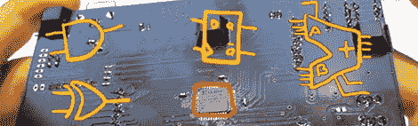

# 博拉板教二进制硬件

> 原文：<https://hackaday.com/2012/10/29/bora-board-teaches-binary-hardware/>

如果你刚刚开始寻求制造真正酷的电子设备，你会发现为初学者准备了大量的选择。Arduino 使切换引脚变得非常简单，Raspi 带来了从命令行闪烁 LED 的奇迹，从神那里传到普通人的手中。不过，这些都是软件平台，如果你想用硬件学习数字逻辑，最好的选择仍然是装满 7400 系列逻辑芯片的抽屉。

[Colin O'Flynn]希望通过一个用于数字逻辑硬件设计的初学者板来改变这种情况。它被称为 BORA，或二进制探索板，将数字逻辑纳入一个方便的封装中，远比充满逻辑芯片的试验板更令人沮丧。

BORA 基于 CPLD——我们不时看到的 FPGA 供电器件的近亲——允许任何数字逻辑学生对器件进行编程，并用 NAND、nor 和 and 填充宏单元。

[宝来使用的 Xilinx 器件](http://www.xilinx.com/support/documentation/data_sheets/ds057.pdf)大约有 1600 个门可以编程；足够完成[在线讲座](http://www.youtube.com/playlist?list=PLDFF5A99731ECFC6C&feature=plcp)【科林】加起来的所有项目了。你可以在官方网站查看宝来[的文档，以及休息后的演示视频。](http://www.binaryexplorer.com/tiki-index.php?page=Documentation)

[https://www.youtube.com/embed/eaXSF-y0KBs?version=3&rel=1&showsearch=0&showinfo=1&iv_load_policy=1&fs=1&hl=en-US&autohide=2&wmode=transparent](https://www.youtube.com/embed/eaXSF-y0KBs?version=3&rel=1&showsearch=0&showinfo=1&iv_load_policy=1&fs=1&hl=en-US&autohide=2&wmode=transparent)