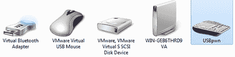

# 用键盘模拟提取数据

> 原文：<https://hackaday.com/2012/10/30/extracting-data-with-keyboard-emulation/>

计算机安全专家面临的一个常见挑战是从一个非常封闭的系统中获取数据。当然，这些测试机上的所有网络流量都受到监控，刻录 CD 或写入 USB 闪存驱动器是不可能的。有志者事竟成，所以安德拉斯想出了通过模仿键盘从电脑中提取数据的方法。

模拟 USB HID 设备并不是什么新鲜事；最新的 Arduino 可以做到这一点，任何 AVR 在 [V-USB](http://www.obdev.at/products/vusb/index.html) 的帮助下都可以做到。[András]的构建模仿了 USB 键盘，可以通过收听 NUM、CAPS 和 SCROLL lock LEDs 从计算机下载数据。

当然，[安德拉什]首先需要一个 app，通过这些键盘状态指示灯传输数据。为此，他的版本在 AVR 的闪存上带有一个 Windows 可执行文件。将他的设备插入计算机后，它将这个程序写入磁盘，然后能够通过键盘状态 led 发送数据。

它的速度不是很快——仅超过每秒一个字节——但[安德拉什]确实设法从计算机中提取数据，绕过了几乎所有的防泄漏解决方案。