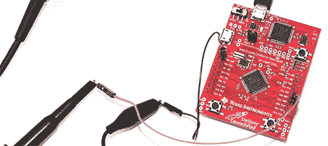

# Stellaris 启动板上的 PWM

> 原文：<https://hackaday.com/2012/10/31/pwm-on-the-stellaris-launchpad/>

[Joonas]一直在关注 TI 新 Stellaris Launchpad 的“入门”教程。一切都进行得很顺利，直到[Joonas]完成了关于中断的第四个教程。令世界各地的 led 愤怒的是，在新的 Stellaris Launchpad 上实现 PWM 有点困难。在埋头研究文档数小时后，[Joonas] [终于破解了他的 PWM 问题](http://codeandlife.com/2012/10/30/stellaris-launchpad-pwm-tutorial/)，并决定与世界分享他的发现。

Stellaris 的六个硬件定时器有一个 PWM 模式，但不幸的是，芯片上没有 PWM 单元。解决这个问题需要用一个 32 位定时器制作两个 16 位定时器。这允许[Joonas]指定“加载”和“匹配”值。

编码完成后，[Joonas]发现 PWM 定时器只能在 Launchpad 的两个引脚上工作。几个小时的谷歌搜索之后，他在 Stellaris Launchpad 上有了真正的 PWM。

鉴于[Joonas]在这个问题上花费的时间，我们很高兴通过分享这个来帮助所有其他沮丧的 Stellaris 修补者。