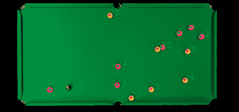

# 台球的计算机跟踪

> 原文：<https://hackaday.com/2012/10/31/computer-tracking-of-billard-balls/>

总部位于伦敦的初创公司 GoCardless 的员工在他们的办公室里有一张台球桌。作为技术人员，他们决定建立一个自动评分系统。虽然结果并不完全完整，但对于在 48 小时的黑客马拉松中产生的东西来说，[仍然令人印象深刻。](http://blog.gocardless.com/post/34568593614/hacking-on-side-projects-the-pool-ball-tracker)

自动计分员使用一个贴在台球桌正上方天花板上的摄像头导管，球——红色和黄色的球取代了实心和条纹的彩虹，使事情变得更容易——是使用 [OpenCV](http://opencv.willowgarage.com/wiki/) 找到的。

这座建筑还没有完全完工。GoCardless 的人员希望通过使用更高帧率的摄像机来提高他们设置的准确性，并可能转向物理模拟来预测球应该在哪里。如果这些人有时间，他们可以添加类似于[增强现实台球桌](http://hackaday.com/2009/09/20/pool-playing-robot-arpool/)的东西来提高拍摄精度。

休息后的维迪亚。

[https://www.youtube.com/embed/rzYYlxj0bxc?version=3&rel=1&showsearch=0&showinfo=1&iv_load_policy=1&fs=1&hl=en-US&autohide=2&wmode=transparent](https://www.youtube.com/embed/rzYYlxj0bxc?version=3&rel=1&showsearch=0&showinfo=1&iv_load_policy=1&fs=1&hl=en-US&autohide=2&wmode=transparent)