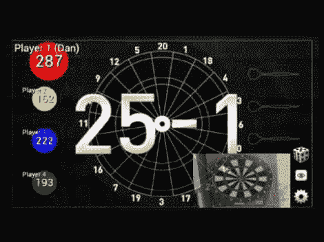

# 廉价的电子飞镖被黑客利用安卓系统得分

> 原文：<https://hackaday.com/2012/10/31/cheap-electronic-dartboard-hacked-to-use-android-for-scoring/>

[丹]拿了一个 13 美元的电子镖靶，[让它与一个安卓设备](http://amqsoftware.com/~yocom/projects/darts.php)一起工作。其背后的想法是，这些廉价的电子模型具有非常稀疏的显示屏。以这个价格，我们并不感到惊讶。他想增加你在投币式游戏机上能找到的功能，就像在酒吧里找到的那种。所以他增加了一些硬件，让他可以使用 Android 作为记分牌。

要做到这一点，他所需要的是检测飞镖何时击中棋盘以及记录了什么值的能力。该板实际上只不过是一个由 62 个按钮组成的 8×8 矩阵输入设备。他在引脚和 DIP 插座之间焊接跳线。工作完成后，他编写了他的 Cordium BASIC 微控制器，一个 28 针芯片，并把它放了进去。它与串行蓝牙模块通信，该模块提供与 Android 手机的连接。休息之后，你可以看到一个嵌入的应用程序的快速剪辑。

如果你在飞镖靶附近的电视上使用 Android 机顶盒，这将是完美的。

[https://www.youtube.com/embed/F9hRHOLr6AQ?version=3&rel=1&showsearch=0&showinfo=1&iv_load_policy=1&fs=1&hl=en-US&autohide=2&wmode=transparent](https://www.youtube.com/embed/F9hRHOLr6AQ?version=3&rel=1&showsearch=0&showinfo=1&iv_load_policy=1&fs=1&hl=en-US&autohide=2&wmode=transparent)