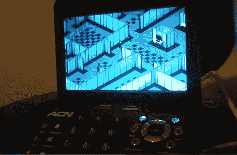

# 在办公室电话上玩视频游戏

> 原文：<https://hackaday.com/2012/11/01/playing-video-games-on-your-office-phone/>

所以它锁定了你的电脑，但是如果你足够幸运拥有这种型号的电话，你仍然可以在工作时玩视频游戏。在旧货店，他只花了 8 美元就买到了一部 ACN 可视电话，现在他可以用这部电话玩视频游戏。我们不知道有什么神奇的二手商店出售这种功能的电子产品，但你永远不应该错过这样的机会。

原来这款手机原生运行的是 Linux。经过一番搜索后，[AUTUIN]发现可以远程登录到设备上的根外壳。这样一来，他就能发现手机使用了标准的软件包，比如音频使用 ALSA，键盘使用/dev/input/event0。它甚至包括一个 SD 卡插槽，所以他加载了一个 Debian 映像，并使用 pivot_root 切换到那个操作系统。在这一点上，手机是他的命令，当然，他加载了一个视频游戏，你可以在休息后的剪辑中看到。

[https://www.youtube.com/embed/aE-_JsrnICg?version=3&rel=1&showsearch=0&showinfo=1&iv_load_policy=1&fs=1&hl=en-US&autohide=2&wmode=transparent](https://www.youtube.com/embed/aE-_JsrnICg?version=3&rel=1&showsearch=0&showinfo=1&iv_load_policy=1&fs=1&hl=en-US&autohide=2&wmode=transparent)