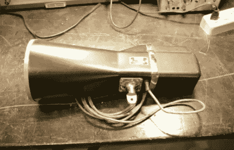

# 黑掉一把旧雷达枪来连接笔记本电脑

> 原文：<https://hackaday.com/2012/11/01/hacking-an-old-radar-gun-to-interface-with-a-laptop/>

[Gregory Charvat]决定看看他能用这把旧的警用雷达枪做些什么。这是一种 X 波段设备，可以广播连续波，并在回波返回时测量多普勒频移。他把它打开[，看看他是否能把输出与计算机连接起来](http://www.youtube.com/watch?v=GoHiod4lNck)。

经过一段时间的摸索，他能够将它连接到他的工作台电源的 12V 电源上，并用示波器监控输出。他确定它消耗大约 0.5A 的电流。他建造了一个同伴板，使用 AA 电池供电，并提供音频输出，可以插入他的笔记本电脑的音频输入插孔。这项技术使得读取设备就像录制音频一样简单。从那里开始，一点简单的信号处理就能让他绘制出测量结果。

在休息后的视频中，您将看到他对硬件的检查。改装后，他把它带到野外，量了几辆车，几只鸟，自己也在慢跑。

[https://www.youtube.com/embed/GoHiod4lNck?version=3&rel=1&showsearch=0&showinfo=1&iv_load_policy=1&fs=1&hl=en-US&autohide=2&wmode=transparent](https://www.youtube.com/embed/GoHiod4lNck?version=3&rel=1&showsearch=0&showinfo=1&iv_load_policy=1&fs=1&hl=en-US&autohide=2&wmode=transparent)